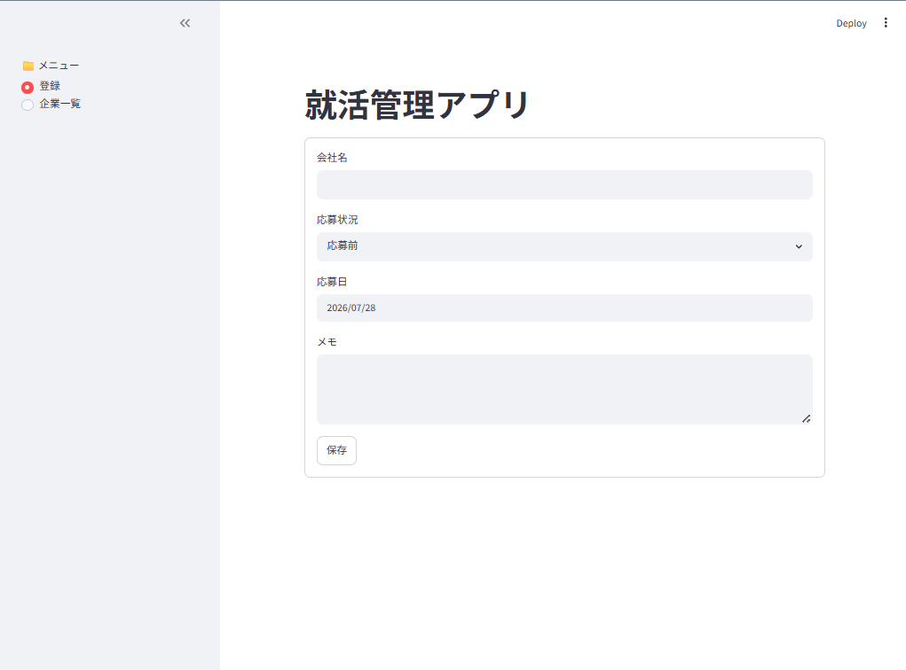
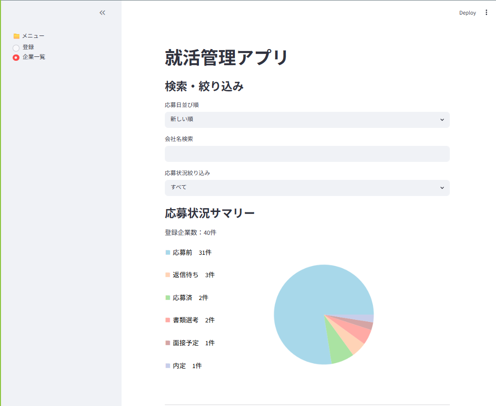
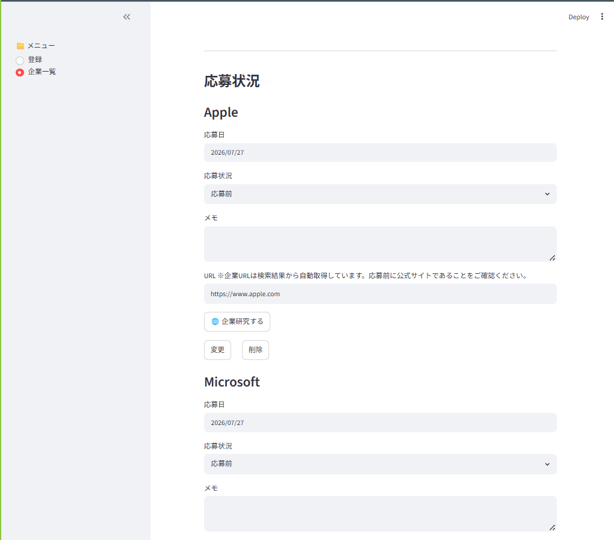

# Shukatsu Manager


就職活動で応募した企業を管理するためのWebアプリです。

応募企業の登録・編集・検索・管理に加え、企業名から公式サイトを自動取得する機能を実装しています。

## 概要
応募した企業の情報を登録・管理できるWebアプリです。

## スクリーンショット

### 登録画面



### 一覧・応募状況サマリー



### 編集画面



現在は以下の機能を実装しています。

- 企業名・応募日・応募状況・メモの登録
- Tavily APIを利用した企業公式サイトの自動取得
- SQLiteを利用したデータの登録・編集・削除（CRUD）
- 登録企業の一覧表示
- 応募状況を円グラフで可視化
- 企業名による検索機能
- 重複企業の登録防止

就職活動中の応募企業を一元管理し、応募状況を効率よく把握できることを目的として制作しました。

---

## 使用技術

- Python
- Streamlit
- SQLite
- Tavily API
- Git / GitHub

---

## 学習ポイント

このアプリの制作で実装を通して学習・習得しました。

- PythonによるWebアプリケーション開発
- Streamlitを用いた画面設計
- SQLiteを利用したデータベース操作
- SQL（CREATE / INSERT / SELECT / UPDATE / DELETE）
- PythonとSQLiteの連携
- fetchone()・fetchall() の使い分け
- 関数化によるコードの整理・再利用
- Git / GitHub を利用したバージョン管理
- APIを利用した外部サービスとの連携

---

## 工夫した点

- Tavily APIを利用して企業名から公式サイトを自動取得
- 求人サイトや口コミサイトを除外し、公式サイトのみを登録するようNGドメイン判定を実装
- 重複登録を防止し、データの整合性を維持
- 処理を関数化し、可読性・保守性を意識したコード構成
- Streamlitのフォームを利用し、入力しやすいUIを意識しました。

---

## 今後の改善予定

- CSVエクスポート機能
- Streamlitマルチページ化
- ユーザー認証機能
- UI / UXの改善

---

## 実行方法

必要ライブラリをインストールします。

```bash
pip install -r requirements.txt
```

アプリを起動します。

```bash
streamlit run app.py
```

---

## 制作目的

就職活動で応募した企業情報を効率よく管理するために制作しました。

また、Python・SQL・Streamlit・GitHubを用いたWebアプリケーション開発の学習成果をまとめたポートフォリオ作品として開発しました。